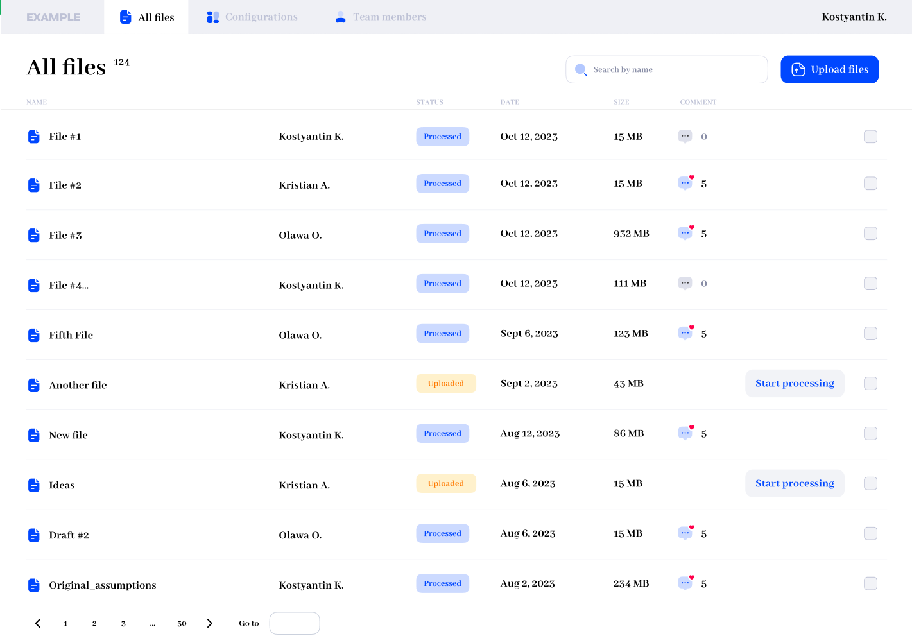

## Content
- [Part 1](#part-1-coding-with-react)
- [Part 2](#part-2-file-upload-to-s3-description)
- [Run project](#to-start)

## Part 1 Coding with React

### **Objective**

Recreate a web page based on the provided image using React.js for front-end development:



Please use the below endpoint to retrieve the data needed to fill the page with information.

The endpoint is a mock server created using Prism. It will always return example data (unless non-default mocking settings are specified).

[Get Drawings | Test-API-FE-AS](https://coxit-test.stoplight.io/docs/test-api-fe-as/branches/main/iuhughaz2uzto-get-drawings)

### **Instructions**

1. You are provided with an image that represents the layout and design of a web page.
2. Your task is to write the necessary React components and CSS code to recreate the web page as accurately as possible based on the provided image. However, a 100% match is not required.
3. Ensure the React components are well-structured and follow best practices.
4. Make the page responsive and compatible with modern web browsers.
5. Pay attention to detail, including spacing, fonts, colors, and overall layout fidelity.
6. Optionally, you can utilize any additional libraries or frameworks if you believe they will aid in achieving the desired result.

## Part 2 File Upload to S3 Description

Please, switch to `part_2` branch and inside the `part2` directory you will find my solution.

## To start
1. Install dependencies using
```bash
npm run install
```
2. Run app in dev mode
```bash
npm run dev
```
